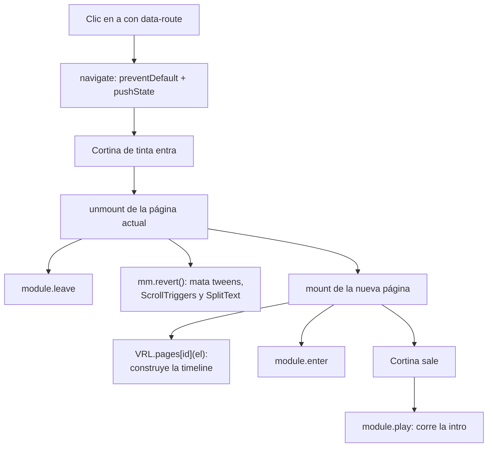

# Vaughn's Tattoos — sitio portafolio

> Documento generado por auditoría de código el 24 de septiembre de 2026.
> Sirve como referencia técnica y como paquete de contexto para retomar el
> desarrollo (p. ej. con Claude Code).
>
> Repo: <https://github.com/Marvizu2304/Vaughns-Tattoos> · En vivo:
> <https://www.vaughnstattoos.com>

## Resumen ejecutivo

Sitio-portafolio de **Vaughn Raffty L.** (VLR Inks), tatuador autodidacta
radicado en Peoria, Illinois. Muestra su obra agrupada en cuatro estilos —
Anime / Illustrative, Traditional, Black & Grey y Line Work — explica el
proceso de reserva en cinco pasos y capta solicitudes de cita mediante un
formulario embebido de Tally.

No hay backend propio, base de datos ni autenticación: es un sitio estático
cuyo único destino de datos es el formulario de un tercero. El valor de
ingeniería está concentrado en la capa de movimiento (GSAP) y en el manejo de
imagen.

*Propósito inferido de los textos de la UI, las rutas y el formulario de
reserva. El negocio en sí (precios, agenda, depósitos) vive fuera del código.*

## Stack tecnológico detectado

| Tecnología | Rol | Evidencia |
|---|---|---|
| HTML / CSS / JS sin build | Todo el sitio; se sirve tal cual | No hay `package.json`, `node_modules` ni config de bundler en el repo |
| GSAP 3.13.0 | Motor de animación completo | `index.html:901-908` (8 scripts desde jsDelivr) |
| ├ ScrollTrigger | Animación ligada al scroll | `index.html:902`, registrado en `js/core.js:36-52` |
| ├ ScrollSmoother | Scroll suavizado por transform | `index.html:903`, `js/core.js:301-341` |
| ├ SplitText | Titulares partidos en líneas/caracteres | `index.html:904`, `js/core.js:89-96` |
| ├ Flip | Vuelo de miniatura → lightbox | `index.html:905`, `js/pages.js` (sección STYLES) |
| ├ Observer | Entrada unificada de puntero/rueda | `index.html:906` |
| ├ DrawSVGPlugin | Trazado de la línea de tinta y los círculos | `index.html:907`, `js/pages.js:955+` |
| └ CustomEase | Curvas propias `needle` e `ink` | `index.html:908`, `js/core.js:57-61` |
| Google Fonts | Archivo Black + Space Grotesk | `index.html:17-19` |
| Tally | Formulario de reserva embebido | `index.html:823` — `https://tally.so/embed/mBV7g5` |
| Cloudflare | Hosting / CDN del sitio en vivo | Cabecera `server: cloudflare` en la respuesta de producción |
| WebP responsive | Todas las fotos, en 800w y 1600w | `images/optimized/`, 105 archivos; `srcset` en `index.html` |

**No se detectó ninguna credencial, token ni clave de API** en el código. Un
barrido de los patrones habituales (`api_key`, `secret`, `sk-`, `AIza`, `eyJ`,
`service_role`, Supabase, Firebase, Stripe) sobre `index.html`, `style.css` y
`js/*.js` no arrojó coincidencias reales. Es coherente con la arquitectura: sin
backend no hay nada que autenticar.

## Arquitectura y flujo de datos

Un solo `index.html` contiene las **cinco páginas** a la vez, como hermanas
`div.page`. Un router propio con History API muestra una y desmonta la otra;
nunca hay recarga.

| Ruta | `id` del `div.page` | Página |
|---|---|---|
| `/` | `home` | Hero, marquee, intro |
| `/about` | `about` | Video de fondo + bio |
| `/styles` | `styles` | Índice de estilos → tira de obra |
| `/booking` | `booking` | Los cinco pasos |
| `/book` | `book-now` | Formulario de Tally |

La tabla vive en `js/app.js:12-18`. Sobre `file://` el router cae a hash
(`js/app.js:25`), así que el sitio también funciona abriendo el archivo a mano.

### Ciclo de vida de una navegación



Lo importante de ese ciclo: **`mount()` reconstruye el módulo de la página en
cada visita** (`js/app.js:68-81`) y `unmount()` lo revierte con
`mm.revert()` (`js/app.js:83-91`). Cualquier listener global que registres
dentro de un módulo se apilará visita tras visita — hay que colgarlo del
contexto de `gsap.matchMedia()` o de un ScrollTrigger de la propia página.

### Flujo de datos

Es deliberadamente corto. El único dato que sale del sitio lo recoge un
tercero:

**visitante → iframe de Tally (`index.html:823`) → Tally → Vaughn**

El sitio no lee, valida ni almacena nada de ese formulario: solo lo enmarca.
Fuera de eso, el único estado persistente es una preferencia de desarrollo en
`localStorage` bajo la clave `vrl-smoother` (`js/core.js:14-35`), que permite
apagar ScrollSmoother con `?smoother=0` para diagnosticar.

## Integraciones externas

| Servicio | Cómo se conecta | Credencial | Implicación |
|---|---|---|---|
| **Tally** | `<iframe>` a `https://tally.so/embed/mBV7g5` (`index.html:823`) | Ninguna. El ID del formulario es público por diseño | Las respuestas viven en la cuenta de Tally, no en el repo. Si se pierde el acceso a esa cuenta, se pierde el canal de reservas |
| **jsDelivr** | 8 `<script>` a `cdn.jsdelivr.net/npm/gsap@3.13.0` (`index.html:901-908`) | Ninguna | Versión fijada (`@3.13.0`), sin `integrity`. Si el CDN no responde, `hasGSAP` es `false` (`js/core.js:39`) y el sitio degrada a estático legible |
| **Google Fonts** | `<link>` a `fonts.googleapis.com` (`index.html:19`) | Ninguna | Con `display=swap`; si no carga, se cae a la familia genérica |
| **Redes sociales** | Enlaces salientes en el footer | Ninguna | Instagram, Facebook, TikTok |

Ninguna de estas integraciones requiere rotar nada ni depende de una clave que
pueda filtrarse.

## Estructura del código

El proyecto **sí está organizado**: capas separadas en archivos reales, con
secciones numeradas y comentarios que explican el porqué de cada decisión. No
hay lógica pegada dentro del HTML ni estilos inline. Lo que sigue es el mapa,
no una lista de problemas.

### `js/core.js` (361 líneas) — infraestructura compartida

IIFE que expone el objeto global `VRL`. Nada aquí sabe de páginas concretas.

| Líneas | Sección | Contenido |
|---|---|---|
| 10-34 | 1. Configuración | Flag `?smoother=0/1` persistido en `localStorage` |
| 36-62 | 2. Plugins | `registerPlugin`, `gsap.defaults`, eases `needle` e `ink` |
| 64-73 | 3. Preferencias | `prefs.reduced` y `prefs.finePointer` como getters vivos |
| 75-96 | 4. Utilidades | `revealAll()`, `splitLines()` |
| 99-166 | 5. Cursor | Punto + contorno con delegación en `document` |
| 169-219 | 6. Botones magnéticos | Delegado sobre `.btn-magnetic`; funciona con nodos nuevos |
| 222-298 | 7. Menú overlay | `initNav()`, `toggleNav()`, trampa de foco |
| 301-341 | 8. ScrollSmoother | `initSmoother()`, `scrollToTop()`, `refresh()` |
| 343-361 | 9. API pública | Lo que `VRL` exporta |

### `js/pages.js` (1185 líneas) — una timeline por página

Registra `VRL.pages[id]`. Cada entrada es una fábrica que recibe el `div.page`
y devuelve `{ mm, play }`.

| Líneas | Página | Notas |
|---|---|---|
| 16-68 | Helpers | `definePage()` envuelve el patrón `matchMedia` + timeline en pausa + salida temprana con reduced-motion. `revealLines()` |
| 70-179 | `home` | Hero, marquee, intro |
| 181-249 | `about` | Video de fondo, bio |
| 251-953 | `styles` | **El grueso del archivo.** Índice tipográfico, pila de piezas que sigue al cursor, tira infinita con arrastre e inercia, lightbox con Flip |
| 955-1052 | `booking` | Línea de tinta con DrawSVG + scrub, círculos trazados, `placeLine()` |
| 1054-1185 | `book-now` | Canvas de partículas de tinta sobre el ticker de GSAP |

La sección `styles` merece una nota: la tira (`.work-strip`) posiciona las
piezas en absoluto y envuelve su `x` con `gsap.utils.wrap`, así que el bucle no
tiene costura ni extremo. **Captura la rueda del ratón** (`onWheel`, con
`preventDefault`) para desplazarse en horizontal; en móvil `touch-action:
pan-y` deja pasar el scroll vertical. Esa diferencia explica por qué varios
ajustes de esta página son solo de desktop.

### `js/app.js` (307 líneas) — router y arranque

| Líneas | Sección | Contenido |
|---|---|---|
| 9-51 | 1. Rutas | Tabla `ROUTES`, detección de `base`, fallback a hash sobre `file://` |
| 53-63 | 2. Estado | Entrada activa, bandera de navegación |
| 65-103 | 3. Montaje | `mount()` / `unmount()` / `syncChrome()` |
| 105-148 | 4. Transición | Cortina de tinta entre páginas |
| 150-195 | 5. Navegación | Delegación sobre `a[data-route]`, `popstate` |
| 197-260 | 6. Preloader | Progreso "honesto": espera `window.load` + `document.fonts.ready` |
| 263-307 | 7. Arranque | Orden obligatorio: smoother antes que cualquier ScrollTrigger |

### `index.html` (914 líneas)

| Líneas | Bloque |
|---|---|
| 1-31 | `<head>`: meta, fuentes, preload del hero, marca `html.js` |
| 43-64 | Preloader |
| 65-91 | Nav y overlay |
| 93-139 | Página `home` |
| 141-161 | Página `about` |
| 163-740 | Página `styles` (la mayor parte son las 51 `<figure>` de la galería) |
| 742-814 | Página `booking` |
| 816-828 | Página `book-now` |
| 831-886 | Footer |
| 887-899 | Lightbox |
| 901-912 | Scripts: GSAP, luego `core` → `pages` → `app` (el orden importa) |

La línea 31 hace algo que conviene no romper: marca `<html class="js">` antes
del primer paint. Los estados iniciales de las animaciones en CSS
(`.js [data-anim] { visibility: hidden }`, `style.css:119`) solo se aplican si
el JS está vivo para revertirlos. Sin JS, el contenido se ve completo.

### `style.css` (1518 líneas)

Secciones marcadas con banners. Las principales: reset (37), estados iniciales
(114), preloader (200), cortina (260), navegación (305), hero (426), botón
magnético (562), styles — índice (689) / detalle (820) / tira (915), booking
(1039), book now (1147), footer (1197), lightbox (1298), responsive (1409) y
reduced-motion (1495).

La paleta y las fuentes viven como custom properties en `:root`
(`style.css:7-34`): crema `#F6F3EC`, tinta `#1a1a1a`, acento `#B9A590`.

### Archivos de apoyo

| Archivo | Para qué |
|---|---|
| `404.html` | **Copia byte a byte de `index.html`.** El hosting lo sirve en rutas profundas y el router toma el control |
| `_redirects` | `/*  /index.html  200` — regla de fallback SPA (ver riesgos) |
| `DEPLOY.md` | Configuración de fallback por hosting |
| `.claude/launch.json` | Servidores de preview: `vrl-site` (4173, con fallback SPA) y `vrl-static` (4174, sin él) |
| `prototypes/` | Tres exploraciones de diseño de la página Styles. No enlazadas desde el sitio |
| `images/optimized/` | Lo que el sitio realmente sirve: 105 WebP en 800w/1600w |

## Desarrollo local

No hay que instalar nada. Hace falta un servidor con fallback SPA, o las rutas
profundas darán 404 al recargar:

```bash
npx -y serve -l 4173 -s .
```

El `-s` es lo que importa: sirve `index.html` para cualquier ruta no
encontrada. Sin él (`vrl-static`, puerto 4174) solo funciona entrar por `/`.

Al tocar el HTML hay que regenerar el espejo, o las rutas profundas seguirán
sirviendo la versión vieja:

```bash
cp index.html 404.html
```

## Riesgos y deuda técnica

**No hay hallazgos críticos.** Sin backend, sin credenciales y sin datos de
usuario en el cliente, la superficie de ataque clásica no existe aquí. Lo que
sigue es sobre todo alcance y mantenibilidad.

### 🟡 Importante

**1. `og:image` es una ruta relativa** — `index.html:13`

```html
<meta property="og:image" content="images/optimized/hero/hero-1400.webp">
```

Open Graph exige URL absoluta. Facebook, WhatsApp, LinkedIn e iMessage no
resuelven rutas relativas, así que al compartir el sitio la vista previa sale
sin imagen. Para un portafolio cuyo tráfico llega desde redes sociales, es la
primera impresión. Tampoco hay `og:url` ni `<link rel="canonical">`.

*Acción:* poner la URL completa
(`https://www.vaughnstattoos.com/images/optimized/hero/hero-1400.webp`) y
añadir `og:url`.

**2. El fallback SPA no está surtiendo efecto en producción**

`_redirects` contiene la regla de reescritura con estado 200, pero medido
contra el sitio en vivo:

```
https://www.vaughnstattoos.com/styles  →  HTTP 404  (cuerpo: el sitio completo)
```

Para una persona funciona — se sirve `404.html`, que es copia de `index.html`,
y el router arranca. Para un buscador, `/styles`, `/booking` y `/book` son
URLs inexistentes, así que probablemente no se indexen. El sitio entero
quedaría reducido a la home en resultados de búsqueda.

*Acción:* confirmar qué plataforma está detrás de Cloudflare y aplicar su
mecanismo de reescritura (ver Preguntas abiertas). En Cloudflare Pages, un
`404.html` presente tiene prioridad sobre `_redirects`; conviene probar
quitándolo.

**3. `404.html` se mantiene a mano**

Es una copia literal de `index.html` (`DEPLOY.md:20-25`). Nada automatiza ni
verifica la copia: si se edita el HTML y se olvida el `cp`, las rutas profundas
sirven en silencio una versión vieja del sitio. Ya ocurrió durante esta
sesión.

*Acción:* un hook de pre-commit, o eliminar la necesidad resolviendo el punto 2.

### 🟢 Menor

**4. 92 MB de JPEG originales versionados y sin usar**

Los 51 archivos bajo `images/ANIME - ILLUSTRATIVE/`, `images/TRADITIONAL/`,
`images/BLACK&GREY - STIPPLE SHADING/` e `images/LINE WORK/` no se referencian
desde ningún `.html`, `.css` ni `.js` (verificado: 0 coincidencias de `.jpeg`,
frente a 163 de `images/optimized`). El sitio sirve exclusivamente
`images/optimized/` (21 MB).

Son el material fuente, así que tiene sentido conservarlos — pero en el
historial de git encarecen cada clon. *Acción:* valorar moverlos fuera del
repo (o a Git LFS) y dejar anotado dónde quedaron.

**5. `prototypes/` se publica en producción**

Las tres exploraciones son alcanzables por URL directa aunque nada las enlace.
No exponen nada sensible, pero son borradores con la marca del cliente.
*Acción:* moverlas a una rama, o excluirlas del despliegue.

**6. Sin `.gitignore`**

Por eso `.DS_Store` y la carpeta `.idea/` (configuración de IntelliJ, propia de
una máquina) están versionados. *Acción:* añadir un `.gitignore` y sacar
`.idea/` del índice.

**7. GSAP sin `integrity` ni copia local** — `index.html:901-908`

La versión está fijada en `@3.13.0`, que es lo importante. Sin atributo
`integrity`, un compromiso del CDN serviría código alterado. El riesgo real es
bajo y el sitio ya degrada con dignidad si jsDelivr falla.

## Próximos pasos sugeridos

En orden de retorno sobre esfuerzo:

1. **Arreglar `og:image` y añadir `og:url`** — cinco minutos, y arregla cómo se
   ve el sitio cada vez que alguien lo comparte. Es el canal principal de un
   tatuador.
2. **Resolver la indexación de las rutas profundas** (riesgo 2). Hoy solo la
   home es indexable; `/styles` es justo la página que debería posicionar.
3. **Añadir `.gitignore` y sacar `.idea/`** del control de versiones.
4. **Decidir qué hacer con los 92 MB de originales** antes de que el historial
   crezca más.
5. **Automatizar o eliminar el espejo `404.html`** — idealmente cae solo al
   resolver el punto 2.

Nada de esto bloquea seguir construyendo funcionalidad. La base está bien
puesta: capas separadas, degradación sin JS, `prefers-reduced-motion`
respetado tanto en CSS como en `gsap.matchMedia()`, e imágenes responsive con
`width`/`height` explícitos.

## Preguntas abiertas

Lo que el código no permite determinar y conviene confirmar:

1. **¿Qué plataforma sirve el sitio?** Las cabeceras solo dicen
   `server: cloudflare`. No hay `CNAME` en el repo ni cabeceras de GitHub
   Pages, Netlify o Vercel. El repo trae `_redirects`, que es sintaxis de
   Netlify y de Cloudflare Pages. Saberlo es requisito para arreglar el riesgo
   2.
2. **¿Cómo se dispara el despliegue?** No hay workflow de GitHub Actions en el
   repo; se asume build automático al hacer push a `main`, pero no está
   verificado.
3. **¿Quién controla la cuenta de Tally?** Es el único punto por donde entran
   las solicitudes de cita y vive fuera del repo.
4. **¿Dónde está registrado `vaughnstattoos.com` y quién lo administra?**
5. **¿Los `prototypes/` siguen siendo material de trabajo** o ya se pueden
   archivar?
6. **¿Existe respaldo de los 51 JPEG originales fuera de este repo?** La
   respuesta cambia si conviene sacarlos del historial.
